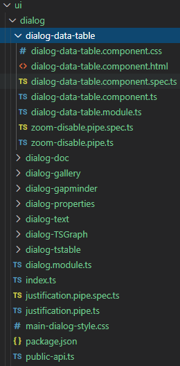

# owf-app-dev-ng

This repository contains the Open Water Foundation (OWF) Angular development web application
(AngularDev), which is used to develop common library code. The libraries can then be used by
other Angular applications such as OWF InfoMapper.

* [Introduction](#introduction)
* [Repository Contents](#repository-contents)
* [Getting Started](#getting-started)
  * [Prerequisites](#prerequisites)
  * [Running the Project](#running-the-project)
* [Angular Library Concepts](#angular-library-concepts)
  * [Entry Points](#entry-points)
* [Sharing Libraries with AngularDev](#sharing-libraries-with-angulardev)
  * [Library Setup](#library-setup)
  * [Application Setup](#application-setup)
* [Sharing Libraries with InfoMapper](#sharing-libraries-with-infomapper)
* [Angular Tasks](#angular-tasks)
  * [Naming Conventions](#naming-conventions)
  * [Adding a Class (for non-UI classes)](#adding-a-class-for-non-ui-classes)
  * [Adding a Component (for UI classes)](#adding-a-component-for-ui-classes)
* [Deploying the Site to AWS](#deploying-the-site-to-aws)
* [Contributing](#contributing)
* [Maintainers](#maintainers)
* [Contributors](#contributors)
* [License](#license)

----------------------

## Introduction ##

This repository contains Angular software for common (shared) Angular libraries
that can be used to streamline development of other Angular applications.
Development uses a simple application (AngularDev) that is used for development and testing.

The focus of development is applications developed by OWF.
Libraries are currently not published to the public `npm` registry.
However, it is possible that the libraries will be of benefit to others and
publishing to public `npm` registry may occur in the future.
OWF is evaluating the best way to share libraries, for example using [GitHub packages](https://docs.github.com/en/packages/guides/configuring-npm-for-use-with-github-packages).
The following libraries are included in this repository, in addition to AngularDev application:

| **Library** | **`npm` package** | **Description** |
| -- | -- | -- |
| `owf-common` | `@owf/common` | Useful common code, including application utilities, classes ported from Java, and UI components based on Angular Material. |
| `owf-d3` | `@owf/d3` | [D3.js](https://d3js.org/) dynamic visualizations. |
| `owf-plotly` | `@owf/plotly` | [Plotly.js](https://plotly.com/) chart visualizations. |
| `owf-showdown` | `@owf/showdown` | Markdown to HTML package using [showdown.js](http://showdownjs.com/). |

The library code is packaged with `npm` to share locally with other applications,
including the following OWF applications.

| **Application** | **Description** |
| -- | -- |
| [OWF InfoMapper](https://github.com/OpenWaterFoundation/owf-app-infomapper-ng) | Web mapping and visualization application. |
| InfoMapper Map | Single map that can be embedded in a web page - **to be developed**. |
| [SNODAS web application](https://github.com/OpenWaterFoundation/owf-app-snodas-ng) | Provides access to SNODAS snow data - OWF has developed an Angular version based on previous JavaScript/HTML prototype and needs to migrate to new integrated components.  **Conversion to use new libraries is planned.** |

See the following resources for background information.
This repository generally follows the conventions for an Angular 
"multi-project workspace".

* [Angular web framework](https://angular.io/)
* [Angular - Architecture & Concepts](https://angular.io/guide/architecture)
* [Angular - Workspace and project file structure](https://angular.io/guide/file-structure)
* [Angular - Creating Libraries](https://angular.io/guide/creating-libraries)
* [Angular - Robust Library Architecture](https://medium.com/@tomastrajan/the-best-way-to-architect-your-angular-libraries-87959301d3d3)
* [`npm` - Creating and publishing private packages](https://docs.npmjs.com/creating-and-publishing-private-packages)
* [TypeScript - TSConfig Reference](https://www.typescriptlang.org/tsconfig)

## Repository Contents ##

The following folder structure is recommended for development.
Top-level folders should be created as necessary.
The following folder structure clearly separates user files (as per operating system),
development area (`owf-dev`), product (`AngularDev`),
repositories for product (`git-repos`), and specific repositories for the product.
Currently the application only includes one repository;
however, additional repositories may be added in the future.
Folders within the Angular workspace adhere to Angular standards for a "multi-project
workspace", with the exception of library folder structuring. Libraries use a folder
architecture that is recommended by the developers of the compiler that builds Angular
libraries, `ng-packagr`. If more granular import paths are desired, they recommend using
secondary entry points, similar to Angular Material, and Angular core. This removes the
need for the standard `lib/` folder in the library. See [Entry Points](#entry-points) for more
information. Repository folder names should agree with
GitHub repository names. Scripts in repository folders that process data should detect their
starting location and then locate other folders using relative paths.

```
C:\Users\user\                                 User's home folder for Windows.
/c/Users/user/                                 User's home folder for Git Bash.
/cygdrive/C/Users/user/                        User's home folder for Cygwin.
/home/user/                                    User's home folder for Linux.
  owf-dev/                                     Work done on Open Water Foundation projects.
    AngularDev/                                Angular development application product files.
                                               Other applications such as InfoMapper are similar.
      ------------------------------------------------------------------------------------------
      ----         Above are recommended, below folder names should match exactly.          ----
      ------------------------------------------------------------------------------------------
      git-repos/                               Git repositories for AngularDev application.
        owf-app-dev-ng/                        Angular development application repository.
          .gitattributes                       Main repository attributes.
          .gitignore                           Main repository .gigitnore to ignore files.
          README.md                            This file.
          build-util/                          Useful scripts for building software.
          ng-workspace/                        Angular workspace for the development application.
                                               Use a generic name to emphasize Angular framework.
            dist/                              Built libraries (.gitignored since dynamic).
            node_modules/                      Third party libraries installed via `npm install`.
            projects/                          Standard Angular folder for multi-project workspace.
              angulardev/                      Application project containing main application.
                src/                           Standard Angular folder for source code.
                  app/                         Standard Angular folder indicating application.
                    *                          Application source code.
                  assets/                      Folder containing run-time configuration and data.
                    app-config.json            Application configuration file.
              owf-common/                      Library project containing common (shared) OWF code.
                                               This library is used by other `owf-*` libraries
                                               Specific examples are provided below for illustration.
                src/                           The library's main entry point folder.
                  index.ts                     Placeholder index.ts for main-entry point.
                  public-api.ts                Exported members of the main entry point. NOTE:
                                               The main entry point does not contain any
                                               source code itself. All library source code
                                               resides in secondary entry points.
                ts/                            Time series package (ported from Java).
                  TS.ts                        Time series class.
                  package.json                 Tells ng-packagr to compile this as a
                                               secondary entry point into the library.
                  public-api.ts                Exported members of this ts/ module as
                                               a secondary entry point.
                ui/                            User interface components (based on Material).
                  dialog/                      Code related to dialogs.
                  window-manager/              Code related to Window Manger for managing dialogs.
                    WindowManager.ts           Class to manager windows.
                    package.json
                    public-api.ts
                util/                          Utility code package (ported from Java).
                  time/                        Utility code for date/time.
                    DateTime.ts                Class for date/time.
                    package.json
                    public-api.ts
              owf-d3/                          Library project containing D3.js visualizations.
                *                              Follow Angular secondary entry point folder structure,
                                               with folders to organize package's classes.
              owf-plotly/                      Library project containing plotly.js visualizations.
                *                              Follow Angular secondary entry point folder structure,
                                               with folders to organize package's classes.
              owf-showdown/                    Library project containing Showdown code
                                               (Markdown viewer).
                *                              Follow Angular secondary entry point folder structure,
                                               with folders to organize package's classes.
```

## Getting Started ##

This section explains how to initialize the development environment for AngularDev.

### Prerequisites: ###

Development and deployment of this Angular based web application requires the following tools:

1. Node.js (version 10.x or higher) and npm (version 5.5.1 or higher):
   * Check which version of Node.js is installed by running `node -v`.
   To download Node.js, go to [nodejs.org](nodejs.org). 
   * Check which version of npm is installed by running `npm -v`.
   To update npm run `npm install npm@latest -g`.
2. Angular CLI (Command Line Interface):
   * Check which version of Angular CLI is installed by running `ng --version`.
   If Angular CLI needs installed run `npm install -g @angular/cli`.

### Running the project: ###

Once all prerequisites have been installed, clone this repository onto the
local machine using the recommended folder structure and `cd` into the `projects` directory.
Use the command `npm install` to download all necessary packages and dependencies
used by the application.
Run the site by running the command `ng serve`.
Optionally add the flag `--open` to automatically open the application in a new web browser tab.

## Angular Library Concepts ##

### Entry Points ###

A class is made known to code by using `import` statements. It is desirable that `import`
statements use a full path to classes, to provide transparency and avoid ambiguity. 
Angular libraries may contain many components and classes organized in folders. All Angular
libraries have a main entry point folder, located in the `src/` folder under the library's
top-level folder. The `src/` folder contains a `public-api.ts` file that is needed to export all
modules, classes, etc. so that they can been seen by a consuming application. For example:

```typescript
export * from '@owf/common/dwr/statemod';
export * from '@owf/common/services';
export * from '@owf/common/ts';
export * from '@owf/common/ts-command-processor/commands/delimited';
export * from '@owf/common/ts-command-processor/core';
export * from '@owf/common/ui/dialog';
export * from '@owf/common/ui/layer-manager';
export * from '@owf/common/ui/window-manager';
export * from '@owf/common/util/io';
export * from '@owf/common/util/string';
export * from '@owf/common/util/time';
```

The `public-api.ts` file exports all modules under the folder and therefore can be used when
importing from the library; hence the term 'main entry point'. It is the single
entry point into the library for an application. For example, if the `common` library only had a
main entry point, then a consuming application could import the following for the `StateMod_TS`
class:

```typescript
import { StateMod_TS  } from '@owf/common';
```
or the `StringUtil` class:
```typescript
import { StringUtil } from '@owf/common';
```

This would allow the module location to be resolved, but the exact folder for the class is not
obvious. This is because the compiler uses the main entry point. Secondary entry points
can be used to:

1. Implement precise imports, e.g.
    ```typescript
    import { StateMod_TS } from '@owf/common/dwr/statemod';
    import { StringUtil }  from '@owf/common/util/string';
    ```
2. Enable the ability for a library to split up its dependencies. The default import
statement (`import {} from '@owf/common`) resolves everything in the library, so even though a
relatively small class is needed, the entire library with all dependencies would be required.
Using a secondary entry point in a folder would only need the dependencies of the entry point,
and wouldn't care about the rest of the library. This results in a smaller Webpack, and less
dependencies for a developer or user when using the library.

OWF has implemented a configuration similar to Angular Material, the main
Angular core, and other Google-made libraries supplied by Angular. The developers of the
compiler that builds libraries also recommend this approach for the above reasons, as well as
more that can be found at their
[Secondary Entry Points](https://github.com/ng-packagr/ng-packagr/blob/master/docs/secondary-entrypoints.md) GitHub page. There is also an informative
[Medium](https://medium.com/tunaiku-tech/creating-secondary-entry-points-for-your-angular-library-1d5c0e95600a)
article describing what has been implemented in this library.

## Sharing Libraries with AngularDev ##

### Library Setup ###

The AngularDev application uses many different library modules under the `owf-common/`
folder (e.g. `ts/`, `ui/`, and `util/`) that can be shared with the `angulardev` main
application. To use these modules from the `owf-common` library, the library must be
built using the following:

1. `cd` into `projects/`. 
2. Use the command `ng build owf-common` to build the library into the `ng-workspace/dist/`
folder. The library and its modules are then ready to be consumed by the application.
3. If library code is also being updated, an option for the build command is useful. In the
`projects/` folder , `ng build <lib-name> --watch` will not only build the library, but
will keep listening to the file and watch for any other updates to it. This way, both
the app and library can be updated simultaneously. **NOTE:** `ng build <lib-name> --watch` must
be run before `ng serve`. If built after the app's server is running, warnings and
errors will occur. `<lib-name>` should be replaced with the name of the library to be
built and/or watched. 

### Application Setup ###

The `owf-common` library was added using the command `ng generate library owf-common`.
Angular adds all the necessary references for the new `owf-common` library in workspace files,
one of them being the addition of a `paths` property under **compilerOptions** in the
`projects/tsconfig.ts` file. This property lists aliases that can be used when importing modules
from the library in the app. Override the default by adding the following:

```json
"paths": {
  "@owf/common/*": [
    "projects/owf-common/*",
    "projects/owf-common"
  ]
}
```

Using the `*` wildcard in the path tells consuming modules/classes they need a more descriptive
path to the module to be imported, such as `@owf/common/ui/window-manager` instead of
`@owf/common`. Consequently, there will be no ambiguity as to the module origin.

The following is an example of `import` to use a library class.
Goals of the implementation are:

* Follow standard Angular syntax and protocols.
* Clearly indicate "scope" `@owf` to distinguish as OWF library and avoid conflict
with similarly named classes in other libraries.
* Use folders to emphasize hierarchy of code, similar to other languages.
* Import statements should be the same whether the library is used in AngularDev application,
InfoMapper, or
other application.

```typescript
import { WindowManager } from "@owf/common/ui/window-manager";
```

The `projects/tsconfig.ts` file will look something like to following after the `paths`
property has been defined:

```json
{
  "compileOnSave": false,
  "compilerOptions": {
    "baseUrl": "./",
    "...": "...",
    "paths": {
      "@owf/common/*": [
        "projects/owf-common/*",
        "dist/owf-common/*"
      ]
    }
  },
  "...": "..."
}
```

Since the libraries in this repository only use secondary entry points, the path to the entry
point must be supplied when importing a module. The above tells the `ng-packagr` compiler that an
import using

```javascript
import { WindowManager } from "@owf/common";
```

will _not_ work, as there is no ending slash with the path to the Window Manager's
public api TypeScript file. The previously shown WindowManager import statement containing
the path to the class would work however:

```typescript
import { WindowManager } from "@owf/common/ui/window-manager";
```

## Sharing Libraries with InfoMapper ##

Libraries developed in this repository can be shared with other applications.
The section uses the InfoMapper application as an example to explain how this occurs.

The following is a summary of InfoMapper folder structure.
**Note - InfoMapper will likely be converted to a multi-project workspace in the future
but the following currently uses a single application project folder structure.**

```
C:\Users\user\                   User's home folder for Windows.
/c/Users/user/                   User's home folder for Git Bash.
/cygdrive/C/Users/user/          User's home folder for Cygwin.
/home/user/                      User's home folder for Linux.
  owf-dev/                       Work done on Open Water Foundation projects.
    InfoMapper/                  InfoMapper product files
      ------------------------------------------------------------------------------------------
      ----         Above are recommended, below folder names should match exactly.          ----
      ------------------------------------------------------------------------------------------
      git-repos/                 Git repositories for the InfoMapper application.
        owf-app-infomapper-ng/   Angular web application.
          infomapper/            InfoMapper Angular project folder.
            node_modules/        Third party libraries installed via `npm install`.
                                 Uses a specific name since only one project.
                                 OWF libraries that are deployed from AngularDev application
                                 will install here.
            src/                 Standard Angular folder for source code.
              app/               Standard Angular folder indicating application.
                *                Application source code.
              assets/            Standard Angular folder containing run-time configuration and data.
                app-config.json  Application configuration file.
                *                Other runtime configuration and data files.
```

## Angular Tasks ##

The following sections contain checklists and notes about developing and consuming libraries
from both a workspace and stand-alone application. 

### Naming Conventions ###

#### Scope & Namespace ####
Libraries can have a few different top-level folders, normally the library name. This is not
always the case however. The common library, for example, uses `owf-common/` as
its top level folder name. When using the Angular Command Line Interface (CLI), Angular will
create the folder names. For example, using the command

```
ng generate library my-library
```

creates the top level folder `my-library/`. Another option is to add a scope to the
library with the command

```
ng generate library @my-company/my-library
```

The CLI will create the top level folder `@my-company/`, with `my-library/` under that.
Names and scopes can also be manually changed. When the
`ng generate library` command is used, one of the files it creates is the library's
`package.json` file, which contains the property `name` of the library, which is what
the library's compiler looks for when the `ng build my-library` command is given. This name can
be altered so that another name can be used instead. In the common library, the command

```
ng generate library owf-common
```

was used, creating the `owf-common/` folder. The library's `package.json` was changed as follows:

```json
{
  "name": "@owf/common"
}
```

Even though the file structure still has the `owf-common/` top level file, the library's scope
and name have successfully been changed to `@owf` and `common` respectively.

#### Main & Secondary Entry Points ####

Angular libraries can be consumed by applications in two different ways: using the library's
main and/or secondary 'entry points'. An entry point corresponds to a folder where a
class/componet/module exists. The common library only uses secondary entry points, meaning when
a consuming application imports a class from the library, the following import statement

```typescript
import { TS } from '@owf/common';
```

would not be enough, because it is attempting to use the library's main entry point, and a
specific folder is required. Using only the main entry point is by default how TypeScript
importing works, but thanks to Angular's ng-packagr compiler, options
for more granular imports are given by creating and using secondary entry points. After
research, OWF has decided to use the same structuring that the `ng-packagr` developers and
Angular itself suggest and use.

Normally, a library's top-level structure would look something like the following:

```
my-library/                      The library top-level folder.
  src/                           The library source folder.
    lib/                         The library lib folder where all source files reside.
      *                          The source files of the library (classes, components, etc.)
```

The above import statement using the main entry point would work for this set up, does not
allow for granular import statements. According to one of the two main `ng-packagr` developers,
when using secondary entry points, each entry point folder should exists beneath the library's
top level folder. A more in-depth description can be viewed under the `owf-common/` folder in the
[Repository Contents](#repository-contents) section. Examples of articles that helped OWF
decide approach for library folder structuring can be found at `ng-packagr`'s GitHub
issues [#900](https://github.com/ng-packagr/ng-packagr/issues/900),
[#959](https://github.com/ng-packagr/ng-packagr/issues/959), and
[#987](https://github.com/ng-packagr/ng-packagr/issues/987). 

The `src/` folder only contains an empty `index.ts` file and the main
entry point's `public-api.ts` file that exports all secondary entry points. The library's
main entry point still needs to exist (as indicated by the existence of `public-api.ts` file)
but contains no code.

### Angular Library Concepts ###

The following table summarizes naming conventions used in a library, using `owf-common` as an
example.

| **Library Resource**&nbsp;&nbsp;&nbsp;&nbsp;&nbsp;&nbsp;&nbsp;&nbsp;&nbsp;&nbsp;&nbsp;&nbsp;&nbsp;&nbsp;&nbsp;&nbsp; | **Name**&nbsp;&nbsp;&nbsp;&nbsp;&nbsp;&nbsp;&nbsp;&nbsp;&nbsp;&nbsp;&nbsp;&nbsp;&nbsp;&nbsp;&nbsp;&nbsp;&nbsp;&nbsp;&nbsp;&nbsp;&nbsp;&nbsp;&nbsp;&nbsp;&nbsp;&nbsp;&nbsp;&nbsp;&nbsp;&nbsp;&nbsp;&nbsp;&nbsp;&nbsp;&nbsp;&nbsp;&nbsp;&nbsp;&nbsp;&nbsp;&nbsp;&nbsp;&nbsp;&nbsp;&nbsp;&nbsp;&nbsp;&nbsp;&nbsp;&nbsp;&nbsp;&nbsp;&nbsp;&nbsp;&nbsp;&nbsp;&nbsp;&nbsp;&nbsp;&nbsp;&nbsp;&nbsp;&nbsp;&nbsp;&nbsp;&nbsp;&nbsp;&nbsp;&nbsp;&nbsp;&nbsp;&nbsp;&nbsp;&nbsp;&nbsp;&nbsp; | **Description** |
| -- | -- | -- |
| Library folder | `owf-common` | Folder in `workspace/projects` for library code. |
| Import scope and path | `import { TimeUtil } from @owf/common/util/time` | Import library classes using scope `@owf` and path to class folder (entry point). |
| [tsconfig.json paths](./ng-workspace/tsconfig.json) | <pre>"paths":<br>  "@owf/common/*":<br>    "projects/owf-common/\*",<br>    "dist/owf-common/\*"</pre> | Creates an alias for imports. Any import starting with the path `@owf/common/*` will substitute `dist/owf-common/*` for application compilation or `projects/owf-common/*` for library compilation, and search for an entry point there. |
| Main entry point<br>[public-api.ts](./ng-workspace/projects/owf-common/src/public-api.ts) | `export * from '@owf/common/util/time';` | File exporting every secondary entry point in the library to be consumed by an application, class, module, etc. |
| Secondary entry point<br>[public-api.ts](./ng-workspace/projects/owf-common/dwr/statemod/public-api.ts) | `export * from ./DateTimeUil` | File exporting every class, component, module, etc. in the entry point folder to be found by the main entry point `public-api.ts`. |
| Library [package.json](./ng-workspace/projects/owf-common/package.json) | <pre>"name": "@owf/common",<br>"version": "0.0.1",<br>"peerDependencies": {},<br>"dependencies": {}</pre> | The `common` library's `package.json` contains the library scope and name, the version of the library, and any peer dependencies and dependencies the library relies on. |
| Secondary entry point<br>[package.json](./ng-workspace/projects/owf-common/ts/package.json) | <pre>"ngPackage": {<br>  "lib": {<br>    "entryFile": "public-api.ts",<br>    "cssUrl": "inline"<br>  }<br>}</pre> | Contains basic information that declares this folder as a secondary entry point. This file is identical for every secondary entry point folder. |
| `npm` zip file | `owf-common-<version>.tgz` | The tarball file created after `npm pack` is run in the library's `dist/` folder. The scope and version are taken from the library's [package.json version](./ng-workspace/projects/owf-common/package.json) `name` property. |
| `node_modules` folder | `node_modules/@owf/common` | The `npm` installed `common` package in a consuming application's `node_modules/` folder. Run `npm install path/to/zip/file` to install in `node_modules`. |
| Git Packages | **Needs to be researched** |  |

### Adding a Class (for non-UI classes) ###

Classes that do not include UI-components can be added to libraries. There are two different
instances when a regular, non-UI class can be added: Adding it as a
[new entry point](#brand-new-class-and-secondary-entry-point) folder, and
the simpler process of adding it to an already
[existing entry point](#adding-a-class-to-an-existing-entry-point) folder.

#### New Class and Secondary Entry Point ####

To add a new class in a new folder:

1. Top-level folder: Create folder(s) for code
    * If necessary, create a folder directly underneath the top-level library folder. This will
    be the first folder given in the import path after the library scope and name, e.g.

      ```typescript
      "@owf/common/util"
      ```

      Determine if more folders need to be created for the desired structuring. The longest / 
      deepest folder will contain the entry point. In the `common` library for example, the
      path <br>`ts-command-processor/commands/delimited` has nested folders, with `delimited/`
      being the entry point.

    If a branching import path wants to be added to the library:
    * Create the sub folders if necessary, for additional levels of code hierarchy. For example
    if `ts-command-processor/commands/` already exists and the sub-folder `core/` is to be added
    at the same level as `commands/`, then `cd` into `ts-command-processor` and create `core/`.
    Any subsequent nested folders can be created as needed.

2. Convert the folder to an entry point by adding these 3 files with the following content:
    * `index.ts` - Export the entry point's `public-api.ts`. This file is always one line,
    exporting all content from the `public-api` file. 
      ```typescript
      export * from './public-api';
      ```
    * `public-api.ts` - Export the new class using the class name:
      ```typescript
      export * from './WriteDelimitedFile_Command';
      ```
      NOTE: Another name for this file has been confirmed to be `projects.ts`. If using the
      Angular CLI, any library created after the first will contain a `projects.ts` file
      in place of the `public-api.ts` file. OWF is researching why the file name is changed,
      and how it still seems to serve the same purpose.
    * `package.json` - Finish letting `ng-packagr` know this is a secondary entry point by
    adding the following:
      ```json
      {
        "ngPackage": {
          "lib": {
            "entryFile": "public-api.ts",
            "cssUrl": "inline"
          }
        }
      }
      ```
3. Create the class in the entry point folder:
    ```typescript
    export class MyClass {
      constructor() {}
    }
    ```
4. Export the newly created secondary entry point from the main entry point so it can be
consumed by an application. This is done in the main entry point's `public-api.ts` file
under the library's `src/`. Again, using the `delimited/` example:

    ```typescript
    export * from '@owf/common/ts-command-processor/commands/delimited';
    ```

    Note that importing and exporting classes between entry points **must** use absolute
    paths (in this case scope and path), and not relative (`../../path/to/class`). See issue
    [#987](https://github.com/ng-packagr/ng-packagr/issues/987) for more information. Also
    confirm the workspace `tsconfig.json` file has been updated so that the `@` scope
    path-finding can be used. See [Application Setup](#application-setup) for information.
5. In the consuming application, import the entry point in the desired location by importing the
same path given in the main entry point export, e.g.

    ```typescript
    import { WriteDelimitedFile_Command } from '@owf/common/ts-command-processor/commands/delimited';
    ```

    The class name itself is not required at the end of the path, because the compiler only cares about the entry point for the class.

#### Adding a Class to an Existing Entry Point ####

Since the entry point has already been created and exported in the main entry point
`public-api.ts` file, after the class has been created and placed in the entry point's folder,
adding it is simple:

1. Export the class from the entry point's `public-api.ts`, e.g.
    ```typescript
    export * from './newClass';
    ```

The new class can now be consumed by an application using an import statement with the path to
the entry point.

### Adding a Component (for UI classes) ###

A component is more complex than non-UI classes in that it contains features to manipulate the
DOM and change/update/show web page content to users. An example of the folder structure in the
common library is the `dialog` entry point.



To create a component, first create entry point folders as per the
[new entry point](#brand-new-class-and-secondary-entry-point) checklist for the
`ui/dialog/` folder, including the creation of the 3 necessary files to
convert the `dialog` folder into an entry point. Each `dialog-*` folder in the above image
contains its own component. To keep things more compartmentalized, each component has its own
`module.ts` that exports the component for use elsewhere. For more information on Angular
modules, components and services, see the
[Angular Concepts Documentation](https://angular.io/guide/architecture).

1. Change to `ui/dialog` folder. Create the component using:
    * `ng generate module dialog-data-table` - The CLI will create a new folder `new-module/`
    with a `dialog-data-table.module.ts` file.
    * `cd dialog-date-table/`
    * `ng generate component dialog-data-table` - The CLI will create the `.css`, `.html`,
    `spec.ts`, and `.ts` files
2. Add the component and module to the entry point's `public-api.ts` or `projects.ts` file:
    * `export * from './dialog-data-table/dialog-data-table.component';`
    * `export * from './dialog-data-table/dialog-data-table.module';`
3. Export this entry point's `public-api.ts` file from the library's main
entry point:
    * `export * from '@owf/common/ui/dialog';` - This only needs to be done
    once.

An application can now import the component in a component or class of its
own to use it's TypeScript source code:

```typescript
import { DialogDataTableComponent } from '@owf/common/ui/dialog';
```

or import its Module into its own to use the Component's HTML:

```typescript
import { DialogDataTableModule } from '@owf/common/ui/dialog';
```

### Adding a Library ###

Creating an Angular library using the CLI will automatically update necessary files. There are
3 main ways to create a library in a workspace:

1. Use the CLI to create a new scope and library name by using the following commands:
    * `cd ng-workspace/projects/`
    * `ng generate library @scope/lib-name`. For example, `ng generate library @scope/lib-name`.

    The CLI will set the correct scope and package name in the library's
    `package.json`, and create `@scope/lib-name/` as two directories.
2. Use the CLI to create a new library only:
    * `cd ng-workspace/projects/`
    * `ng generate library lib-name`. For example, `ng generate library common`

    If a scope is needed, it needs to be manually added to the library's `package.json` name
    property. Only a `lib-name/` folder will be used.
3. Use the CLI to create a new library, then change the library name manually:
    * `cd ng-workspace/projects/`
    * `ng generate library lib-name`. For example, `ng generate library common`

    In the library `package.json`, add a scope to the library, and change the name in the name
    property. This way, The folder structure remains as `ng-workspace/projects/lib-name`,
    but the library scope and name are `@scope/new-lib-name`. This was done for the
    `@owf/common` library.

### Adding a Test ###

**To be implemented.**

### Running Tests ###

**To be implemented.**


## Deploying the Site to AWS ##

**This section needs to be updated.  It may be helpful to deploy the application to cloud
server for testing. The following was copied from InfoMapper but has not been updated for
AngularDev.**

The site can be built in a `dist` folder for local testing by using
the command

`ng build --prod --aot=true --baseHref=. --prod=true --extractCss=true --namedChunks=false --outputHashing=all --sourceMap=false`

The content of the `dist` folder can imitate a production build of the
InfoMapper. To run the InfoMapper in its distributable form, navigate to
the `build-util` folder and run the `run-http-server-8000.sh` file. In a
web browser, type in `http://localhost:8000/`, then click on
**dist/ > infomapper** to run the InfoMapper.

Once checked locally, deploy to the Amazon S3 site by
running the following in the `build-util` folder using a Windows command shell:

```
copy-to-owf-amazon-s3.bat
```

For example, see the deployment script for the Poudre Basin Information
InfoMapper implementation.
[Poudre Basin Information](http://poudre.openwaterfoundation.org/latest/#/content-page/home)

The above can be run if Amazon Web Services credentials are provided.
A batch file is used to overcome known issues running in Git Bash.

## Contributing ##

Contributions can be made via normal Git/GitHub protocols:

1. Those with commit permissions can make changes to the repository.
2. Use GitHub Issues to suggest changes (preferred for small changes).
3. Fork the repository and use pull requests.
Any pull requests should be based on current master branch contents.

## Maintainers ##

The AngularDev application and libraries are maintained by the Open Water Foundation.

## License ##

The AngularDev and library code are licensed under the GPL v3+ license. See the
[GPL v3 license](LICENSE.md).

