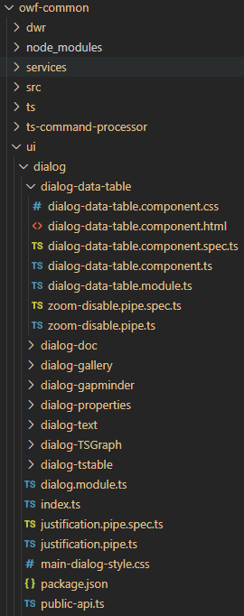

# owf-app-dev-ng

This repository contains the Open Water Foundation (OWF) Angular development web application
(AngularDev), which is used to develop common library code. The libraries can then be used by
other Angular applications such as OWF InfoMapper.

* [Introduction](#introduction)
* [Repository Contents](#repository-contents)
* [Getting Started](#getting-started)
* [Sharing Libraries with AngularDev](#sharing-libraries-with-angulardev)
* [Sharing Libraries with InfoMapper](#sharing-libraries-with-infomapper)
* [Angular Tasks](#angular-tasks)
* [Deploying the Site to AWS](#deploying-the-site-to-aws)
* [Contributing](#contributing)
* [Maintainers](#maintainers)
* [Contributors](#contributors)
* [License](#license)

----------------------

## Introduction ##

This repository contains Angular software for common (shared) Angular libraries
that can be used to streamline development of other Angular applications.
Development uses a simple application (AngularDev) that is used for development and testing.

The focus of development is applications developed by OWF.
Libraries are currently not published to the public `npm` registry.
However, it is possible that the libraries will be of benefit to others and
publishing to public `npm` registry may occur in the future.
OWF is evaluating the best way to share libraries, for example using [GitHub packages](https://docs.github.com/en/packages/guides/configuring-npm-for-use-with-github-packages).
The following libraries are included in this repository, in addition to AngularDev application:

| **Library** | **`npm` package** | **Description** |
| -- | -- | -- |
| `owf-common` | `ng-owf-common` | Useful common code, including application utilities, classes ported from Java, and UI components based on Angular Material. |
| `owf-d3` | `ng-owf-d3` | D3.js dynamic visualizations. |
| `owf-plotly` | `ng-owf-plotly` | Plotly.js chart visualizations. |
| `owf-showdown` | `ng-owf-showdown` | Markdown to HTML package using showdown.js. |

The library code is packaged with `npm` to share locally with other applications,
including the following OWF applications.

| **Application** | **Description** |
| -- | -- |
| [OWF InfoMapper](https://github.com/OpenWaterFoundation/owf-app-infomapper-ng) | Web mapping and visualization application. |
| InfoMapper Map | Single map that can be embedded in a web page - **to be developed**. |
| [SNODAS web application](https://github.com/OpenWaterFoundation/owf-app-snodas-ng) | Provides access to SNODAS snow data - OWF has developed an Angular version based on previous JavaScript/HTML prototype and needs to migrate to new integrated components.  **Conversion to use new libraries is planned.** |

See the following resources for background information.
This repository generally follows the conventions for an Angular 
"multi-project workspace".

* [Angular](https://angular.io/) web framework
* [Angular - Workspace and project file structure](https://angular.io/guide/file-structure)
* [Angular - Creating Libraries](https://angular.io/guide/creating-libraries)
* [`npm` - Creating and publishing private packages](https://docs.npmjs.com/creating-and-publishing-private-packages)

## Repository Contents ##

The following folder structure is recommended for development.
Top-level folders should be created as necessary.
The following folder structure clearly separates user files (as per operating system),
development area (`owf-dev`), product (`AngularDev`),
repositories for product (`git-repos`), and specific repositories for the product.
Currently the application only includes one repository;
however, additional repositories may be added in the future.
Folders within the Angular workspace adhere to Angular standards for a "multi-project
workspace". Repository folder names should agree with GitHub repository names. Scripts in
repository folders that process data should detect their starting location
and then locate other folders using relative paths.

```
C:\Users\user\                                 User's home folder for Windows.
/c/Users/user/                                 User's home folder for Git Bash.
/cygdrive/C/Users/user/                        User's home folder for Cygwin.
/home/user/                                    User's home folder for Linux.
  owf-dev/                                     Work done on Open Water Foundation projects.
    AngularDev/                                Angular development application product files.
                                               Other applications such as InfoMapper are similar.
      ------------------------------------------------------------------------------------------
      ----         Above are recommended, below folder names should match exactly.          ----
      ------------------------------------------------------------------------------------------
      git-repos/                               Git repositories for AngularDev application.
        owf-app-dev-ng/                        Angular development application repository.
          .gitattributes                       Main repository attributes.
          .gitignore                           Main repository .gigitnore to ignore files.
          README.md                            This file.
          build-util/                          Useful scripts for building software.
          ng-workspace/                        Angular workspace for the development application.
                                               Use a generic name to emphasize Angular framework.
            dist/                              Used to build distributions (contents are .gitignored since dynamic).
            node_modules/                      Third party libraries installed via `npm install`.
            projects/                          Standard Angular folder for multi-project workspace.
              angulardev/                      Application project containing main application.
                src/                           Standard Angular folder for source code.
                  app/                         Standard Angular folder indicating application.
                    *                          Application source code.
                  assets/                      Standard Angular folder containing run-time configuration and data.
                    app-config.json            Application configuration file.
              owf-common/                      Library project containing common (shared) OWF code.
                                               This library is used by other `owf-*` libraries
                                               Specific examples are provided below for illustration.
                src/                           The library's main entry point folder.
                  index.ts                     Placeholder index.ts for main-entry point.
                  public-api.ts                Exported members of the main entry point. NOTE:
                                               The main entry point does not contain any
                                               source code itself. All library source code
                                               resides in secondary entry points.
                ts/                            Time series package (ported from Java).
                  TS.ts                        Time series class.
                  package.json                 Tells ng-packagr to compile this as a
                                               secondary entry point into the library.
                  public-api.ts                Exported members of this ts/ module as
                                               a secondary entry point.
                ui/                            User interface components (based on Material).
                  dialog/                      Code related to dialogs.
                  window-manager/              Code related to Window Manger for managing dialogs.
                    WindowManager.ts           Class to manager windows.
                    package.json
                    public-api.ts
                util/                          Utility code package (ported from Java).
                  time/                        Utility code for date/time.
                    DateTime.ts                Class for date/time.
                    package.json
                    public-api.ts
              owf-d3/                          Library project containing D3.js visualizations.
                *                              Follow standard Angular folder structure,
                                               with folders to organize package's classes.
              owf-plotly/                      Library project containing plotly.js visualizations.
                *                              Follow standard Angular folder structure,
                                               with folders to organize package's classes.
              owf-showdown/                    Library project containing Showdown code
                                               (Markdown viewer).
                *                              Follow standard Angular folder structure,
                                               with folders to organize package's classes.
```

## Getting Started ##

This section explains how to initialize the development environment for AngularDev.

### Prerequisites: ###

Development and deployment of this Angular based web application requires the following tools:

1. Node.js (version 10.x or higher) and npm (version 5.5.1 or higher):
   * Check which version of Node.js is installed by running `node -v`.
   To get Node.js, go to [nodejs.org](nodejs.org). 
   * Check which version of npm is installed by running `npm -v`.
   To update npm run `npm install npm@latest -g`.
2. Angular CLI (Command Line Interface):
   * Check which version of Angular CLI is installed by running `ng --version`.
   If Angular CLI needs installed run `npm install -g @angular/cli`.

### Running the project: ###

Once all prerequisites have been installed, clone this repository onto the
local machine using the recommended folder structure and `cd` into the `infomapper` directory.
Use the command `npm install` to download all necessary packages and dependencies
used by the application.
Run the site by running the command `ng serve`.
Optionally add the flag `--open` to automatically open the application in a new web browser tab.

**Need to explain library build process within this application (see previous section).**

## Sharing Libraries with AngularDev ##

### Library Setup ###

The AngularDev application uses many different library modules under the `owf-common/`
folder (e.g. `ts/`, `ui/`, and `util/`) that can be shared with the `angulardev` main
application. To use these modules from the `owf-common` library, the library must be
built using the following:

1. `cd` into `projects/`. 
2. Use the command `ng build owf-common` to build the library and put it into the
`dist/` folder under the `ng-workspace`. Now the library and its modules are ready
to be consumed by the application.
3. In a developing environment, if the library is also being updated, an option for
the build command is useful. `ng build --watch` will not only build the library, but
will keep listening to the file and watch for any other updates to it. This way, both
the app and library can be updated simultaneously. **NOTE:** `ng build --watch` must
be run before `ng serve`. If built after the app's server is running, warnings and
errors will occur.

### Application Setup ###

The `owf-common` library was added using the command `ng generate library owf-common`.
Angular adds all the necessary references for the new `owf-common` library around the
workspace, one of them being the addition of a **paths** property under
**compilerOptions** in the `projects/tsconfig.ts` file. This property lists aliases
that can be used when importing modules from the library in the app. Override the
default by adding the following:

```json
"paths": {
  "@owf/common/*": [
    "projects/owf-common/*",
    "projects/owf-common"
  ],
  "@owf/common": [
    "dist/owf-common/*",
    "dist/owf-common"
  ]
}
```

The first path tells the app that importing something from `@owf-common` is the main
entry point for the library (currently empty). This may be updated to something else
in the future.

The second will be for all other modules in the library, where a more descriptive path
to the module will be needed, such as `@owf-common/ui/window-manager/WindowManager`.
This way, there will be no ambiguity as to where the module originated from.

* Use GitHub packages or local files to hand off `npm` packages?

The following is an example of `import` to use a library class.
Goals of the implementation are:

* Follow standard Angular syntax and protocols.
* Clearly indicate "namespace" `owf-common` to distinguish as OWF library and avoid conflict
with similarly named classes in other libraries.
* Use folders to emphasize hierarchy of code, similar to other languages.
* Code should be the same whether the library is used in AngularDev application, InfoMapper, or
other application.

```javascript
import { WindowManager } from "@owf/common/ui/window-manager"
```

The `projects/tsconfig.ts` file will look something like the following after the paths
property has been entered:

```json
{
  "compileOnSave": false,
  "compilerOptions": {
    "baseUrl": "./",
    "...": "...",
    "paths": {
      "@owf/common/*": [
        "projects/owf-common/*",
        "dist/owf-common/*"
      ]
    }
  },
  "...": "..."
}
```

Since the libraries in this repo only use secondary entry points, the path to the entry point
must be supplied when importing a module. The above tells the ng-packagr compiler that an import
using

```javascript
import { WindowManager } from "@owf/common";
```

will _not_ work, as there is no ending slash with the path to the Window Manager's
public api TypeScript file. The first import statement provided would work however.

## Sharing Libraries with InfoMapper ##

Libraries developed in this repository can be shared with other applications.
The section uses the InfoMapper application as an example to explain how this occurs.

The following is a summary of InfoMapper folder structure.
**Note - InfoMapper will likely be converted to a multi-project workspace in the future
but the following currently uses a single application project folder structure.**

```
C:\Users\user\                   User's home folder for Windows.
/c/Users/user/                   User's home folder for Git Bash.
/cygdrive/C/Users/user/          User's home folder for Cygwin.
/home/user/                      User's home folder for Linux.
  owf-dev/                       Work done on Open Water Foundation projects.
    InfoMapper/                  InfoMapper product files
      ------------------------------------------------------------------------------------------
      ----         Above are recommended, below folder names should match exactly.          ----
      ------------------------------------------------------------------------------------------
      git-repos/                 Git repositories for the InfoMapper application.
        owf-app-infomapper-ng/   Angular web application.
          infomapper/            InfoMapper Angular project folder.
            node_modules/        Third party libraries installed via `npm install`.
                                 Uses a specific name since only one project.
                                 OWF libraries that are deployed from AngularDev application
                                 will install here.
            src/                 Standard Angular folder for source code.
              app/               Standard Angular folder indicating application.
                *                Application source code.
              assets/            Standard Angular folder containing run-time configuration and data.
                app-config.json  Application configuration file.
                *                Other runtime configuration and data files.
```

* Explain how the application sees library modules via `npm` packages and `node_modules`.
* See Sofia's [owf-app1-ng](https://github.com/OpenWaterFoundation/owf-app1-ng) documentation.
* Copy the above here and tighten up, or add a separate Markdown file in this repo.
* Should this use GitHub packages to get `npm` packages?
* `tsconfig.json`
* `import` syntax
* anything else?

## Angular Tasks ##

The following sections contain checklists and notes about developing and consuming libraries
from both a workspace and stand-alone application. 

### Naming Conventions ###

#### Scope & Namespace ####
Libraries can have a few different top-level folders. Normally, the name of the library is this
folder, but it does not have to be. The common library for example contains **owf-common/** as
its top level folder name. When using the Angular Command Line Interface (CLI), Angular will
take care of creating the folder names. For example, using the command

```
ng generate library my-library
```

would create the top level folder **my-library/**. Another option is to add a scope to the
library with the command

```
ng generate library @my-company/my-library
```

The CLI will create the top level folder **@my-company/**, with **my-library/** under that.
There is still another way as well, where names and scopes can be manually changed. When the
`ng generate library` command is used, one of the files it creates is the library's
**package.json** file, which contains the property **name** of the library in it. This is what
the library's compiler looks for when the `ng build my-library` command is given. This name can
be altered so that another name can be used instead. In the common library, the command

```
ng generate library owf-common
```

was used, creating the **owf-common/** folder. Updating the name property in the library's
**package.json** could then be done, changing it like so:

```json
{
  "name": "@owf/common"
}
```

Even though the file structure still has the **owf-common/** top level file, the library's scope
and name have successfully been changed to `@owf` and `common` respectively.

#### Main & Secondary Entry Points ####

Angular libraries can be consumed by applications in two different ways: using the library's
main and/or secondary 'entry points'. An entry point is a way in for an application that wants
to use the library's information. The common library only uses its secondary entry points,
meaning when a consuming application imports a class from it, using the import statement

```typescript
import { TS } from '@owf/common';
```

would not be enough, as that is attempting to use the library's main entry point. This is by
default how TypeScript importing works, but thanks to Angular's ng-packagr compiler, options
for more granular imports are given by creating and using secondary entry points. After
researching, OWF has decided to use the same structuring that the ng-packagr developers and
Angular itself suggest and use.

Normally, a library's top-level structure would look something like the following:

```
my-library/                      The library top-level folder.
  src/                           The library source folder.
    lib/                         The library lib folder where all source files reside.
      *                          The source files of the library (classes, components, etc.)
```

The above import statement would work for this set up, but not for the way the common library
was implemented. According to one of the two main ng-packagr developers, when using secondary
entry points, each should be placed in their own folders right underneath the library's top
level folder. A more in-depth description can be viewed under the **owf-common/** folder in the
[Repository Contents](#repository-contents) section. Examples of articles that helped OWF
decide what route to take for library folder structuring can be found at ng-packagr's GitHub
issues [#900](https://github.com/ng-packagr/ng-packagr/issues/900),
[#959](https://github.com/ng-packagr/ng-packagr/issues/959), and
[#987](https://github.com/ng-packagr/ng-packagr/issues/987). 

Here, the **src/** folder only contains an index.ts (currently not doing anything) and the main
entry point's **public-api.ts** file that exports all secondary entry points. The library's
main entry point still needs to exist, it just contains no code itself so that the more granular
imports can be used on the secondary entry point folders.

### Adding a Class (for non-UI classes) ###

Classes whose main purpose is to do computations behind the scenes and provide other utility
functions can be added to libraries. There are two different instances when a regular, non-UI
class can be added: Adding it as a
[brand new entry point](#brand-new-class-and-secondary-entry-point) into the library, and
the much easier process of adding it to an already
[existing entry point](#adding-a-class-to-an-existing-entry-point).

#### Brand New Class and Secondary Entry Point ####

If a new class has been determined to have a difference in functionality to be separated from
other classes in it's own secondary entry point, the following steps can be taken.

1. Create a folder directly underneath the top-level library folder. This will be the first
folder given in the import path after the library scope and name, e.g.

    ```typescript
    "@owf/common/util"
    ```

    Determine if more folders need to be created for the desired structuring. The longest / 
    deepest folder will contain the entry point. In the `common` library for example, the
    path <br>**ts-command-processor/commands/delimited** has nested folders, with **delimited**
    being the entry point.
2. Now that the desired entry point folder has been identified, convert it to one by adding
these 3 files with the following content:
    * **index.ts** - Export the entry point's `public-api.ts`
      ```typescript
      export * from './public-api';
      ```
    * **public-api.ts** - Export the class using the class name to be consumed. In the
    **delimited/** case:
      ```typescript
      export * from './WriteDelimitedFile_Command';
      ```
      NOTE: Another name for this file has been confirmed to be `projects.ts`.
    * **package.json** - Finish letting ng-packagr know this is a secondary entry point by
    adding the following:
      ```json
      {
        "ngPackage": {
          "lib": {
            "entryFile": "public-api.ts",
            "cssUrl": "inline"
          }
        }
      }
      ```
3. Export the newly created secondary entry point from the main entry point so it can be
consumed by an application. This is done in the main entry point's **public-api.ts** file
under the library's **src/**. Again, using the **delimited/** example, would be

    ```typescript
    export * from '@owf/common/ts-command-processor/commands/delimited';
    ```

    Note that the importing and exporting of classes between entry points **must** be absolute
    paths, and not relative. See issue
    [#987](https://github.com/ng-packagr/ng-packagr/issues/987) for more info. Also confirm
    the workspace `tsconfig.json` file has been updated so that the @ scope path finding can be
    used. See [Application Setup](#application-setup) for help.
4. In the consuming application (an application in the same workspace is assumed) import the
entry point in the desired location by importing the same path given in the main entry point
export, e.g.

    ```typescript
    import { WriteDelimitedFile_Command } from '@owf/common/ts-command-processor/commands/delimited';
    ```

    The class name itself is not required in the path, as the application only cares about where
    the entry point for the class is located.

#### Adding a Class to an Existing Entry Point ####

Since the entry point has already been created and exported in the main entry point
**public-api.ts** file, after the class has been created and placed in the entry point's folder,
adding it is a simple as:

1. Export the class from the entry point's **public-api.ts**, e.g.
    ```typescript
    export * from './newClass';
    ```

The new class can now be consumed by an application using the path to the entry point.

### Adding a Component (for UI classes) ###

The addition of Components to a library implies that there is a need to actually manipulate the
DOM and change/update/show something to users. An example of the folder structure in the common
library is the dialog entry point.



To create a layout similar to this, the first 2 points from the
[brand new entry point](#brand-new-class-and-secondary-entry-point) checklist
can be followed, which helps determine what the entry point folder will be
(**dialog/** in this case), and the creation of the 3 necessary files to
convert the folder into an entry point (Notice all 3 are directly below
the aforementioned **dialog/** folder). Here, each **dialog-\*** folder represents its own
component. **Needs to be finished**

### Adding a Library ###

When creating an Angular library, using the CLI is a good way to leave granular file updates up
to Angular. **Needs to be finished**

### Adding a Test ###

**To be implemented**

### Running Tests ###

**To be implemented**


## Deploying the Site to AWS ##

**This section needs to be updated.  It may be helpful to deploy the application to cloud
server for testing. The following was copied from InfoMapper but has not been updated for
AngularDev.**

The site can be built in a `dist` folder for local testing by using
the command

`ng build --prod --aot=true --baseHref=. --prod=true --extractCss=true --namedChunks=false --outputHashing=all --sourceMap=false`

The content of the `dist` folder can imitate a production build of the
InfoMapper. To run the InfoMapper in its distributable form, navigate to
the `build-util` folder and run the `run-http-server-8000.sh` file. In a
web browser, type in `http://localhost:8000/`, then click on
**dist/ > infomapper** to run the InfoMapper.

Once checked locally, deploy to the Amazon S3 site by
running the following in the `build-util` folder using a Windows command shell:

```
copy-to-owf-amazon-s3.bat
```

For example, see the deployment script for the Poudre Basin Information
InfoMapper implementation.
[Poudre Basin Information](http://poudre.openwaterfoundation.org/latest/#/content-page/home)

The above can be run if Amazon Web Services credentials are provided.
A batch file is used to overcome known issues running in Git Bash.

## Contributing ##

Contributions can be made via normal Git/GitHub protocols:

1. Those with commit permissions can make changes to the repository.
2. Use GitHub Issues to suggest changes (preferred for small changes).
3. Fork the repository and use pull requests.
Any pull requests should be based on current master branch contents.

## Maintainers ##

The AngularDev application and libraries are maintained by the Open Water Foundation.

## License ##

The AngularDev and library code are licensed under the GPL v3+ license. See the
[GPL v3 license](LICENSE.md).

# Notes and Thoughts #

`ng g library @my-scope/my-library` can be used to automatically create the scope and library
name, so no changes will have to be made to the library's top level package.json file. 

| **Workflow Step** | **Name**&nbsp;&nbsp;&nbsp;&nbsp;&nbsp;&nbsp;&nbsp;&nbsp;&nbsp;&nbsp;&nbsp;&nbsp;&nbsp;&nbsp;&nbsp;&nbsp;&nbsp;&nbsp;&nbsp;&nbsp;&nbsp;&nbsp;&nbsp;&nbsp;&nbsp;&nbsp;&nbsp;&nbsp;&nbsp;&nbsp;&nbsp;&nbsp;&nbsp;&nbsp;&nbsp;&nbsp;&nbsp;&nbsp;&nbsp;&nbsp;&nbsp; | **Description** |
| -- | -- | -- |
| Library folder | `owf-common` | Folder in `workspace/projects` for library code. |
| Import scope and path | `import {} from @owf/???` | Import library classes using scope `@owf` and path to class folder (entry point). |
| `tsconfig.json` paths | <pre>"paths":<br>  "@scope/lib/*":<br>    "dist/lib/\*"</pre> | Creates an alias for imports. Any import starting with the defined path `@scope/lib/*` will substitute in `dist/lib/*` and look for entry point there. |
| public api | `public-api.ts` or `projects.ts` | File exporting every class, component, module, etc. to be consumed by the outside world. |
| package.json | `package.json` |  |
| `npm` zip file | `<scope>-<lib_name>-<version>.tgz` | The tarball file created after `npm pack` is done under the library's **dist/** folder. |
| `node_modules` folder | `node_modules/` |  |
| OWF product folder |  |  |
| etc. | | | 